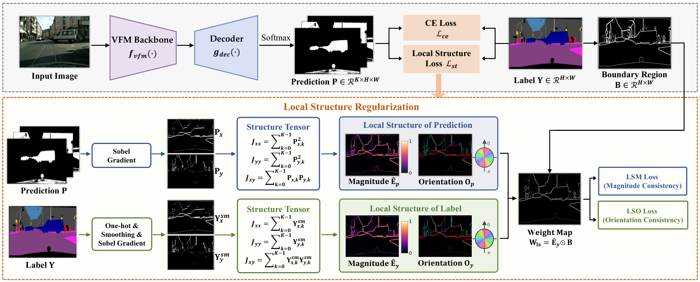

# Local Structure Regularization for Semantic Segmentation

This repository provides a plug-and-play PyTorch loss for semantic segmentation. Add it to an existing training objective without changing the model, backbone, or decoder. The complete implementation is in the single file [`ls_loss.py`](ls_loss.py).

## Method Figure

 [](figures/method_ls.pdf)

The PNG is an inline preview; click it to open the original [PDF figure](figures/method_ls.pdf).

## Features

- **Plug and play:** use the model's existing `[B, C, H, W]` logits and `[B, H, W]` labels; no architecture or feature-extractor changes.
- **Composable:** add LS to cross entropy or another task loss as an auxiliary term.
- **Boundary-aware:** emphasizes local structure around label boundaries and supports ignored labels.
- **Ablation-ready:** use orientation (LSO), magnitude (LSM), or their combined regularizer.

## Requirements

- Python 3.9 or newer
- PyTorch

Install PyTorch for your platform using the [official instructions](https://pytorch.org/get-started/locally/).

## Quick Start

`logits` must have shape `[B, C, H, W]`; integer `target` must have shape `[B, H, W]` and contain class IDs in `[0, C)`, apart from `ignore_index`.

Use an outer `lambda_ls` weight of `0.1` to `1.0` as a starting range; the example default is `0.3`. This coefficient scales the complete LS term and is separate from the internal LSO/LSM balancing parameters.

```python
import torch
import torch.nn.functional as F

from ls_loss import LocalStructureRegularizationLoss

num_classes = 4
logits = torch.randn(2, num_classes, 128, 128, requires_grad=True)
target = torch.randint(0, num_classes, (2, 128, 128))

criterion = LocalStructureRegularizationLoss(
    num_classes=num_classes,
    ignore_index=255,
    label_smooth_kernel=3,
    boundary_kernel=3,
    lambda_orientation=1.0,
    lambda_magnitude=1.0,
)

lambda_ls = 0.3
task_loss = F.cross_entropy(logits, target, ignore_index=255)
loss = task_loss + lambda_ls * criterion(logits, target)
loss.backward()
```

For a component ablation, import `LocalStructureOrientationLoss` (LSO) or `LocalStructureMagnitudeLoss` (LSM) from the same file. These classes accept the same common arguments; the magnitude class additionally accepts `mag_loss_type="l1"`, `"mse"`, or `"log_l1"`.

## API

```python
LocalStructureRegularizationLoss(
    num_classes,
    ignore_index=255,
    label_smooth_kernel=3,
    boundary_kernel=3,
    lambda_orientation=1.0,
    lambda_magnitude=1.0,
    mag_loss_type="l1",
    eps=1e-7,
)
```

`label_smooth_kernel` and `boundary_kernel` are rounded up to the next odd positive integer. `ignore_index` can be one integer or a collection of ignored labels. When a batch has no valid pixels or no weighted target boundary, the loss returns a differentiable zero. Keep the loss module on the same device as the model (for example, `criterion = criterion.to(device)`).

Pass predictions and labels at the same spatial resolution. The loss does not resize either input.