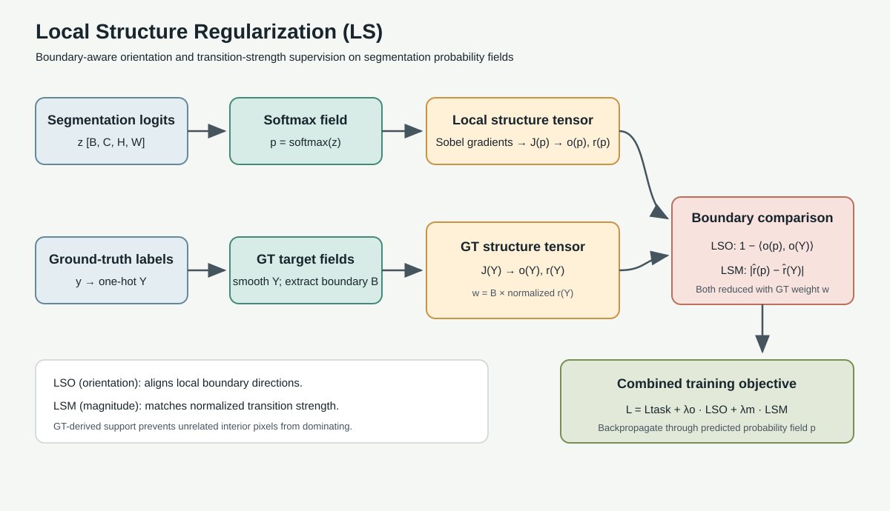

# Local Structure Regularization for Semantic Segmentation

This repository provides a compact PyTorch implementation of local structure regularization for semantic segmentation. The loss operates on the predicted class-probability field and regularizes boundary orientation (LSO), transition magnitude (LSM), or both. The complete implementation is in the single file [`ls_loss.py`](ls_loss.py).

## Method



Given segmentation logits $z$ and class labels $y$, probabilities are $p=\operatorname{softmax}(z)$. The one-hot target $Y$ is optionally smoothed with a local mean filter. A target boundary band $B$ is extracted from local class changes, excluding ignored pixels.

For a probability field $q$ (predicted probabilities or smoothed one-hot labels), Sobel derivatives are used to form the structure tensor:

$$
J(q)=\sum_c \begin{bmatrix}
q_{c,x}^2 & q_{c,x}q_{c,y}\\
q_{c,x}q_{c,y} & q_{c,y}^2
\end{bmatrix}.
$$

The local orientation descriptor and anisotropy magnitude are

$$
u(q)=(J_{xx}-J_{yy},\;2J_{xy}),\qquad
o(q)=\frac{u(q)}{\lVert u(q)\rVert_2+\epsilon},\qquad
r(q)=\sqrt{(J_{xx}-J_{yy})^2+4J_{xy}^2+\epsilon}.
$$

Target anisotropy weights the boundary support, so flat or ambiguous target regions contribute less:

$$
w=B\cdot\operatorname{stopgrad}\left(\frac{r(Y)}{\max_{h,w}r(Y)+\epsilon}\right).
$$

The orientation and magnitude terms are

$$
L_{LSO}=\frac{\sum w\left(1-\langle o(p),o(Y)\rangle\right)}{\sum w+\epsilon},\qquad
L_{LSM}=\frac{\sum w\left|\hat r(p)-\hat r(Y)\right|}{\sum w+\epsilon},
$$

where $\hat r$ is normalized by its per-image spatial maximum. The combined objective is

$$
L_{LS}=\lambda_{o}L_{LSO}+\lambda_{m}L_{LSM}.
$$

The default magnitude distance is L1; `mse` and `log_l1` are also supported. The loss is intended as an auxiliary regularizer alongside a task loss such as cross entropy.

## Requirements

- Python 3.9 or newer
- PyTorch

Install PyTorch for your platform using the [official instructions](https://pytorch.org/get-started/locally/).

## Quick Start

`logits` must have shape `[B, C, H, W]`; integer `target` must have shape `[B, H, W]` and contain class IDs in `[0, C)`, apart from `ignore_index`.

```python
import torch
import torch.nn.functional as F

from ls_loss import LocalStructureRegularizationLoss

num_classes = 4
logits = torch.randn(2, num_classes, 128, 128, requires_grad=True)
target = torch.randint(0, num_classes, (2, 128, 128))

criterion = LocalStructureRegularizationLoss(
    num_classes=num_classes,
    ignore_index=255,
    label_smooth_kernel=3,
    boundary_kernel=3,
    lambda_orientation=1.0,
    lambda_magnitude=0.5,
)

task_loss = F.cross_entropy(logits, target, ignore_index=255)
loss = task_loss + 0.2 * criterion(logits, target)
loss.backward()
```

For a component ablation, import `LocalStructureOrientationLoss` (LSO) or `LocalStructureMagnitudeLoss` (LSM) from the same file. These classes accept the same common arguments; the magnitude class additionally accepts `mag_loss_type="l1"`, `"mse"`, or `"log_l1"`.

## API

```python
LocalStructureRegularizationLoss(
    num_classes,
    ignore_index=255,
    label_smooth_kernel=3,
    boundary_kernel=3,
    lambda_orientation=1.0,
    lambda_magnitude=0.5,
    mag_loss_type="l1",
    eps=1e-7,
)
```

`label_smooth_kernel` and `boundary_kernel` are rounded up to the next odd positive integer. `ignore_index` can be one integer or a collection of ignored labels. When a batch has no valid pixels or no weighted target boundary, the loss returns a differentiable zero. Keep the loss module on the same device as the model (for example, `criterion = criterion.to(device)`).

## Training Integration

Add the LS term to an existing segmentation objective:

```python
loss = cross_entropy_loss + lambda_ls * ls_loss(logits, target)
```

Tune `lambda_ls` against the scale of the task loss. For controlled ablations, use LSO or LSM alone and report their weights separately. This implementation does not resize logits or targets; pass predictions and labels at the same spatial resolution.